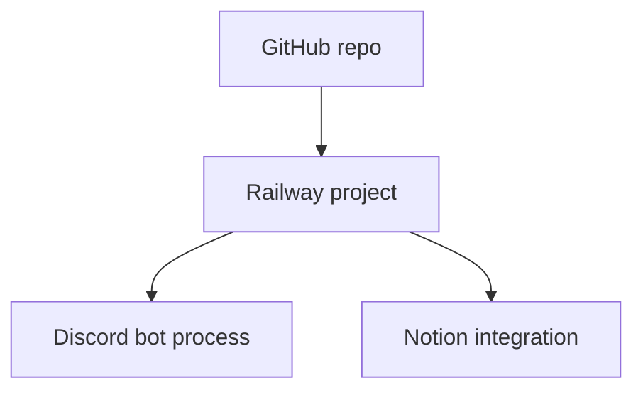

# Discord + Notion Bot Usage Guide

This project is a Discord bot that records trading accountability data in Notion and posts reports back into Discord. You use Discord slash commands for day-to-day work. Notion is the storage layer behind the scenes.

## What the bot does

- Saves daily check-ins, trades, goals, and discipline logs to Notion.
- Generates current week, month, and leaderboard style reports.
- Posts scheduled reports to the configured Discord reports channel.
- Lets you work entirely from Discord after the one-time setup is done.

## Important note about startup

- `npm run register:commands` only needs Discord settings.
- `npm run dev` needs both Discord settings and Notion settings.
- If `NOTION_TOKEN` is missing, the bot cannot start in development mode because it connects to Notion at boot.

## Step-by-step setup

### 1. Install dependencies

Run:

```bash
npm install
```

### 2. Create your `.env` file

Copy `.env.example` to `.env`, then fill in the values.

You must set these first:

- `DISCORD_TOKEN`
- `DISCORD_CLIENT_ID`
- `DISCORD_GUILD_ID`
- `NOTION_TOKEN`
- `NOTION_PARENT_PAGE_ID`

You also need the Discord channel IDs and Notion database IDs before the bot can fully work.

### 3. Create the Notion databases

Once `NOTION_TOKEN` and `NOTION_PARENT_PAGE_ID` are set, run:

```bash
npm run notion:bootstrap
```

This creates the required Notion databases and prints the IDs you need to copy into `.env`.

The script creates these databases:

- `Users`
- `Daily Checkins`
- `Trade Journal`
- `Goals`
- `Discipline Logs`
- `Reports`

### 4. Paste the printed database IDs into `.env`

After bootstrap finishes, copy the printed values into your `.env` file:

- `NOTION_USERS_DB_ID`
- `NOTION_DAILY_CHECKINS_DB_ID`
- `NOTION_TRADE_JOURNAL_DB_ID`
- `NOTION_GOALS_DB_ID`
- `NOTION_DISCIPLINE_LOGS_DB_ID`
- `NOTION_REPORTS_DB_ID`

### 5. Make sure the Discord channel IDs are correct

These channels control where users run the commands and where reports are posted:

- `CHANNEL_DAILY_CHECK_IN_ID`
- `CHANNEL_TRADE_JOURNAL_ID`
- `CHANNEL_WEEKLY_GOALS_ID`
- `CHANNEL_DISCIPLINE_LOG_ID`
- `CHANNEL_PROGRESS_TRACKER_ID`
- `CHANNEL_REPORTS_ID`

Optional channels:

- `CHANNEL_GENERAL_ID`
- `CHANNEL_RESOURCES_ID`

### 6. Register the slash commands

Run:

```bash
npm run register:commands
```

This publishes the Discord slash commands to your guild.

You only need to rerun this when command definitions change.

### 7. Start the bot

Run:

```bash
npm run dev
```

If startup is successful, the bot will log in to Discord and begin listening for interactions and scheduled jobs.

## How to use the bot in Discord

Use the slash commands in the matching channels.

### Daily check-in

Use `/checkin` in `#daily-check-in`.

Required fields:

- `mood` from 1 to 10
- `sleep_hours` as a number
- `energy` from 1 to 10
- `focus` from 1 to 10
- `trading_plan` as text

Example:

```text
/checkin mood:8 sleep_hours:7.5 energy:7 focus:8 trading_plan:Only A+ setups today
```

### Trade journal entry

Use `/trade` in `#trade-journal`.

Required fields:

- `pair`
- `direction` as `Long` or `Short`
- `entry`
- `stop_loss`
- `take_profit`
- `risk_percent`
- `result` as `Win`, `Loss`, `BE`, or `Open`

Optional:

- `screenshot_url`

Example:

```text
/trade pair:EURUSD direction:Long entry:1.0840 stop_loss:1.0815 take_profit:1.0890 risk_percent:1 result:Win screenshot_url:https://example.com/trade.png
```

### Weekly goal

Use `/goal` in `#weekly-goals`.

Required fields:

- `goal`
- `category`
- `deadline` in `YYYY-MM-DD` format

Example:

```text
/goal goal:Take 3 high-quality setups category:Execution deadline:2026-06-12
```

### Update goal status

Use `/goal-status` in `#weekly-goals`.

You need the `goal_id` returned by `/goal`.

Example:

```text
/goal-status goal_id:abc123 status:Completed
```

### Discipline log

Use `/discipline` in `#discipline-log`.

Required booleans:

- `followed_plan`
- `revenge_traded`
- `overtraded`
- `broke_risk_rules`

Example:

```text
/discipline followed_plan:true revenge_traded:false overtraded:false broke_risk_rules:false
```

### Reports and stats

Use these in `#progress-tracker`:

- `/stats`
- `/my-week`
- `/my-month`
- `/leaderboard`

## Recommended daily workflow

1. Open Discord.
2. Run `/checkin` in `#daily-check-in` before trading.
3. Log each trade with `/trade` in `#trade-journal`.
4. Use `/discipline` at the end of the session.
5. Review progress with `/stats`, `/my-week`, or `/my-month`.

## Recommended weekly workflow

1. Create one or more goals with `/goal`.
2. Update them during the week with `/goal-status`.
3. Review the leaderboard and weekly report in `#progress-tracker`.
4. Keep `NOTION_REPORTS_DB_ID` and `CHANNEL_REPORTS_ID` correct so scheduled reports post properly.

## Hosting the bot

If you do not want to keep `npm run dev` open on your own computer, use a cloud host that supports long-running Node.js processes.

### Recommended option: Railway

Railway is the simplest cloud option for this bot if you want GitHub-based deployment and easy environment variable management.

Why it fits this project:

- Easy deployment from GitHub.
- Works well with Node.js apps.
- Lets you manage environment variables in the UI.
- Redeploys automatically when you push to GitHub.
- Good fit for always-on Discord bots.

Typical workflow:



Suggested Railway setup:

1. Push this repo to GitHub.
2. Create a new Railway project from the GitHub repository.
3. Add all required environment variables in Railway, especially:
	 - `DISCORD_TOKEN`
	 - `DISCORD_CLIENT_ID`
	 - `DISCORD_GUILD_ID`
	 - `NOTION_TOKEN`
	 - `NOTION_PARENT_PAGE_ID`
	 - All six Notion database IDs
	 - All required Discord channel IDs
4. Set the build command to `npm run build` and the start command to `npm start`.
5. Run `npm run notion:bootstrap` locally once if you still need to create the Notion databases.
6. Copy the printed Notion database IDs into Railway environment variables.
7. Run `npm run register:commands` locally or from your deployment workflow after the bot is configured.
8. Start the Railway deployment and confirm the bot appears online in Discord.

Important hosting rules:

- Run only one live instance, or scheduled reports will duplicate.
- Never commit `.env` or any real tokens to GitHub.
- Keep the Notion integration limited to the parent page and required databases.
- Make sure the Railway service stays awake 24/7 if you want scheduled reports to fire.

### Other options

If you do not want Railway, the remaining practical choices are:

- A home machine or spare mini PC that stays on.
- A small paid VPS.
- Fly.io or Koyeb if you are comfortable with their free-tier limits.

## Troubleshooting

### `NOTION_TOKEN` is missing

- The bot cannot start with `npm run dev` until `NOTION_TOKEN` is set.
- Add a valid Notion integration token to `.env`.

### `npm run register:commands` fails

- Check `DISCORD_TOKEN`, `DISCORD_CLIENT_ID`, and `DISCORD_GUILD_ID`.
- Make sure your Discord application is correct and the bot is invited to the target guild.

### Bot starts but commands do nothing

- Verify the command was registered with `npm run register:commands`.
- Confirm the bot has permission to read and send messages in the target channels.
- Make sure the command is being used in the correct channel.

### Notion bootstrap fails

- Confirm `NOTION_TOKEN` and `NOTION_PARENT_PAGE_ID` are set.
- Make sure the Notion integration has access to the parent page.
- Rerun `npm run notion:bootstrap` after fixing the env values.

### Reports are not posting

- Check `CHANNEL_REPORTS_ID`.
- Check that the bot can send messages in that channel.
- Make sure the process is running continuously, since scheduled reports depend on the bot staying online.

## Short version

If you already have `.env` filled out, the normal flow is:

1. `npm run notion:bootstrap`
2. Copy the printed Notion database IDs into `.env`
3. `npm run register:commands`
4. `npm run dev`
5. Use the slash commands in Discord
